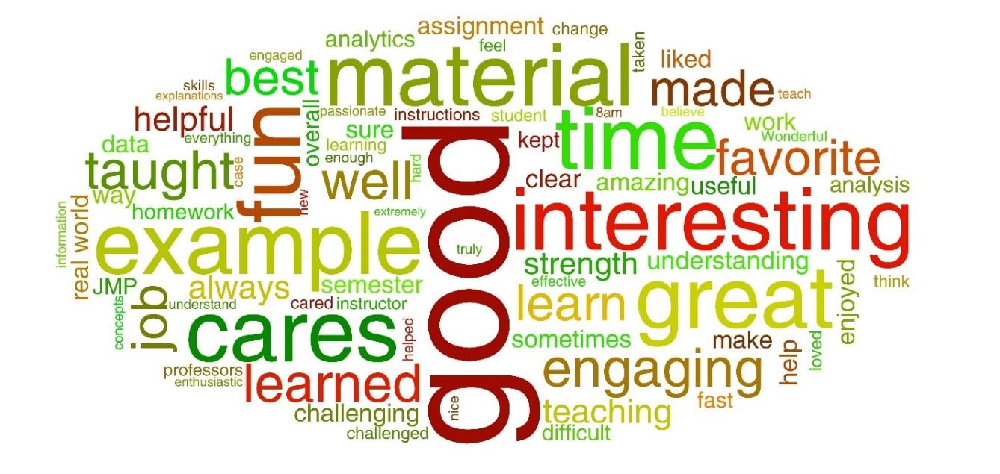

&nbsp;

### Mendoza College of Business, University of Notre Dame

- Marketing Analytics (Undergraduate) 
  - Spring 2021 (scheduled)

&nbsp;

- Marketing Analytics (Graduate)
  - Spring 2021 (scheduled)
  

&nbsp;

### Mays Business School, Texas A&M University

- Marketing Analytics (Undergraduate)
  - Dean’s Award for Outstanding Teaching
  - Fall 2018 (70 students enrolled)
  - Teaching Evaluation (Section 1: 4.89/5; Section 2: 4.80/5)

&nbsp;
 

### Word Cloud of Student Comments 

&nbsp;

### Selected Student Comments

- “This course was the perfect balance of challenging and stimulating. I learned something new every class, and thoroughly enjoyed it.”

- “This course did an amazing job of preparing me for work post-grad as well as connecting to my other classes this semester.”

- “The course challenged me in my analytical thinking and the way I approach big data, I believe it is one of the most interesting classes I have taken here.”

- “The material in this class is perfectly picked. Everything works really well together to carefully explain all of the course material. Wonderful personality and cares so much about the students. Favorite professor of all time. So effective in teaching/engaging.”

- “By far one of the best professors I've ever had. The amount he poured into his students and teaching was immense.”

- “You always bring so much energy & fun to the class, it’s hard to not feel as passionate about the material as you. Favorite class of the semester!”

- “Yixing is an amazing professor and helped make a class that otherwise could have been very dull, very fun! He is super engaging and made coming to class fun. Overall, this was my favorite class this semester. Yixing made learning new/difficult material fun & interesting. I cannot speak highly enough of Yixing and this class.”
